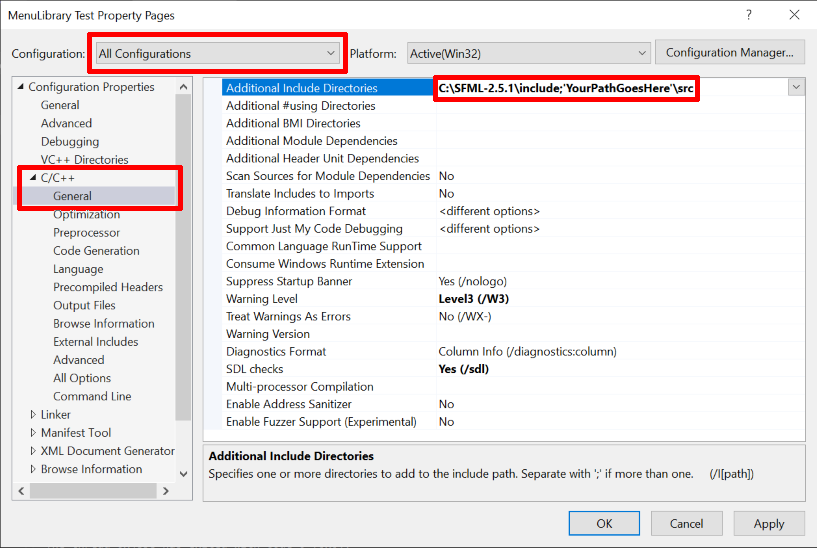
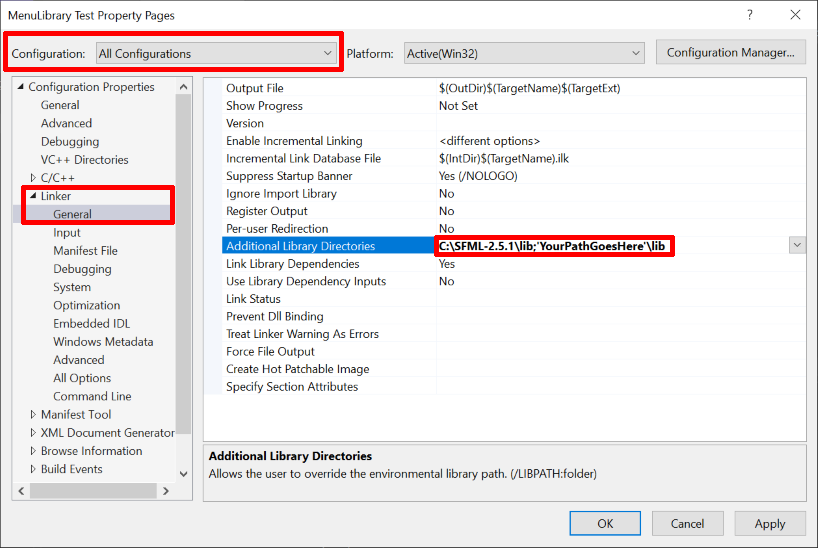
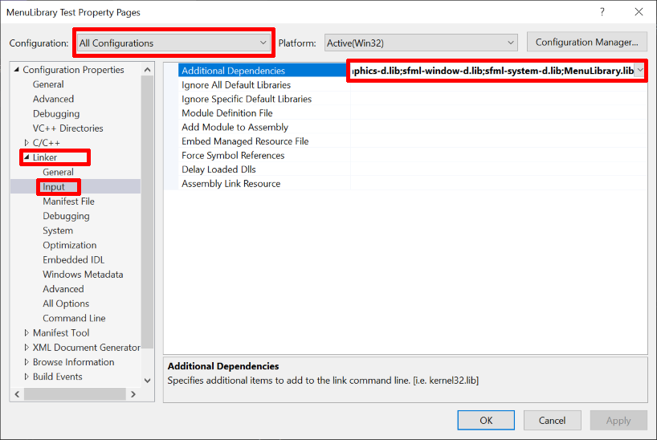

# SFML Simple Menu Library

## About

SFML Simple Menu Library is a C++ library built to work with [SFML](https://www.sfml-dev.org/) (Simple and Fast Multimedia Library) for creating simple and easy-to-use game menus. The library provides a `Menu` class that allows users to create, customize, and manage game menus without having to manually handle the underlying SFML components.

## Table of Contents

- [Dependencies](#dependencies)
- [Installation](#installation)
- [Usage](#usage)
  - [Creating a Menu](#creating-a-menu)
  - [Adding Menu Items](#adding-menu-items)
  - [Customizing Items' Appearance](#customizing-items-appearance)
  - [Customizing Menus](#customizing-menus)
- [Examples](#examples)
- [Limitations](#limitations)

## Dependencies

Your project must be configured to use SFML. If your project is not yet configured to use SFML, follow [the steps found on SFML's site](https://www.sfml-dev.org/tutorials/2.5/start-vc.php) to configure your project.

## Installation

### Visual Studio

You will want to first clone the repo and then copy the  path to this directory.

Configuring your project to use this menu library is very similar to the process for configuring it for SFML, so it is recommended you consult [SFML's setup page]((https://www.sfml-dev.org/tutorials/2.5/start-vc.php)) for help.

#### Steps (under project settings):

* Under additional include directories add ";
'YourPathToTheRepoGoesHere'\src"



* Under additional library directories add ";'YourPathToTheRepoGoesHere'\lib"



* Under additional dependencies add ";MenuLibrary.lib"



## Usage

### Include Header File

```cpp
#include "Menu.h"
```

### Creating a Menu

Then it's as simple as creating a `Menu` object
```cpp
Menu mainMenu;
```

### Adding Menu Items

You can add menu items to the menu using the `addMenuItem()` function. This function takes a reference to the window object as its first argument, followed by the new menu item's text, and an optional `sf::Text` object as a template for the appearance of the menu item.

For example, to add an element with the text "Lives: 3" to the menu:

```cpp
mainMenu.addMenuItem(window, "Lives: 3");
```

### Customizing Items' Appearance

Each menu item is created as a copy of the template provided, either the default `defaultTextObj` or a separate `sf::Text` object.

#### You can change the appearance of menu items in two ways:

1. Configure the `defaultTextObj` variable, which acts as the default template for all new menu items.
2. Provide a separate `sf::Text` object to use as a template when adding a menu item.

#### 1. Configuring `defaultTextObj`

To change the appearance of future menu items, simply modify the properties of the `defaultTextObj`. For example, to set the font size to 24:

```cpp
mainMenu.defaultTextObj.setCharacterSize(24);
```

#### 2. Providing a Separate Text Object

Alternatively, you can provide a separate sf::Text object as a template when adding a menu item. For example, to create a larger score item:

```cpp
 //create new Text object with all the properties of defaultTextObj
sf::Text largeText(mainMenu.defaultTextObj);
largeText.setCharacterSize(36); //but change char size
mainMenu.addMenuItem(window, "Score: 20", largeText);
```

### Customizing Menus

#### Here are some of the functions that exist for customizing `Menu` objects:

`setType(menuType type)`: Sets the menu type to either DYNAMIC or STATIC.

`setDockingPosition(uiTools::cornerType corner)`: Sets the menu's docking position relative to the window.

`setPadding(float x, float y)`: Sets the padding between the edges of the window and the start of the menu.

`setComponentBuffer(int newVal)`: Sets the spacing between menu elements and reformats existing elements to use the new component buffer if necessary.

`setBackgroundColor(sf::Color color)`: Sets the background color of the menu.

#### There also exists some functions for controlling the visibility of the menu, its outline, and its components' outlines

`showMenu()`, `hideMenu()`, `toggleMenuShown()`: Control the visibility of the menu.

`showMenuBounds()`, `hideMenuBounds()`, `toggleMenuBounds()`: Control the visibility of the menu outline.

`showComponentOutlines()`, `hideComponentOutlines()`, 
`toggleComponentOutlines()`: Control the visibility of component outlines.

#### It is recommended to call `Menu::draw()` every frame, and use `showMenu()`, `hideMenu()`, and `toggleMenuShown()` to manage when the menu is shown.

## Examples

In this section, we'll walk you through an example that demonstrates how to create a simple menu using the `Menu` class and how to achieve the same result using plain SFML components.

### Using the Menu Class

```cpp
#include <SFML/Graphics.hpp>
#include "Menu.h"

int main() {
    sf::RenderWindow window(sf::VideoMode(800, 600), "Example with Menus");

    Menu mainMenu;
    mainMenu.setType(Menu::DYNAMIC);
    mainMenu.setDockingPosition(uiTools::TOP_LEFT);
    mainMenu.setPadding(50, 50);
    mainMenu.setComponentBuffer(20);

    mainMenu.addMenuItem(window, "Score: 20");
    mainMenu.addMenuItem(window, "Lives: 3");
    mainMenu.addMenuItem(window, "Items: 4");

    mainMenu.showMenu();

    while (window.isOpen()) {
        sf::Event event;
        while (window.pollEvent(event)) {
            if (event.type == sf::Event::Closed) {
                window.close();
            }
        }

        window.clear();
        mainMenu.draw(window);
        window.display();
    }

    return 0;
}
```

### Using Plain SFML Components

```cpp
#include <SFML/Graphics.hpp>

int main() {
    sf::RenderWindow window(sf::VideoMode(800, 600), "Example with plain components");

    sf::Font font;
    font.loadFromFile("arial.ttf");
    int paddingX = 50;
    int paddingY = 50;
    int componentBuffer = 20;

    sf::Text score("Score: 20", font, 20);
    score.setPosition(50, 50);

    sf::Text lives("Lives: 3", font, 20);
    lives.setPosition(50, 50 + score.getGlobalBounds().height + componentBuffer);

    sf::Text items("Items: 4", font, 20);
    items.setPosition(50, 50 + score.getGlobalBounds().height + lives.getGlobalBounds().height + componentBuffer * 2);

    while (window.isOpen()) {
        sf::Event event;
        while (window.pollEvent(event)) {
            if (event.type == sf::Event::Closed) {
                window.close();
            }
        }

        window.clear();
        window.draw(score);
        window.draw(lives);
        window.draw(items);
        window.display();
    }

    return 0;
}
```

As you can see, using the `Menu` class simplifies the code and is easier to scale.

## Limitations

This menu library is not a full UI library, so it does not contain support for menu items such as buttons, sliders, or images. The purpose is mainly to provide devs a quick and easy way to implement basic text-based menus in their games without muddying up their code.